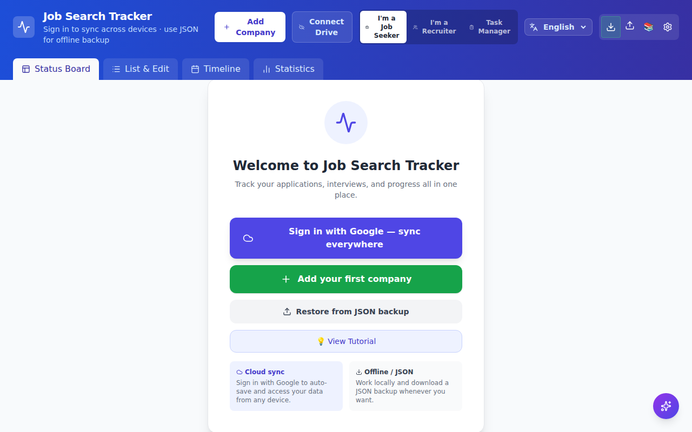
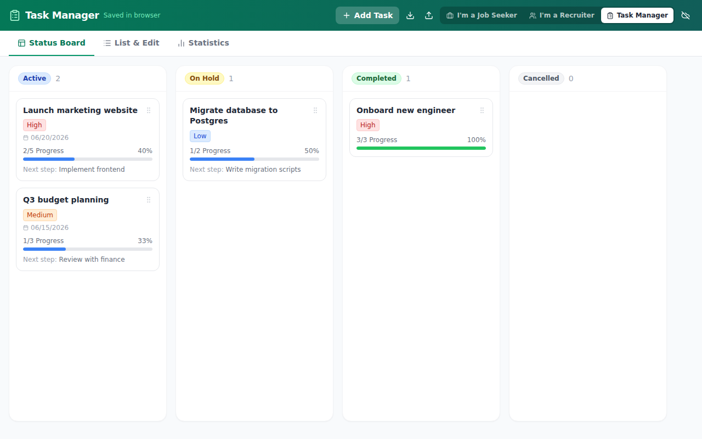
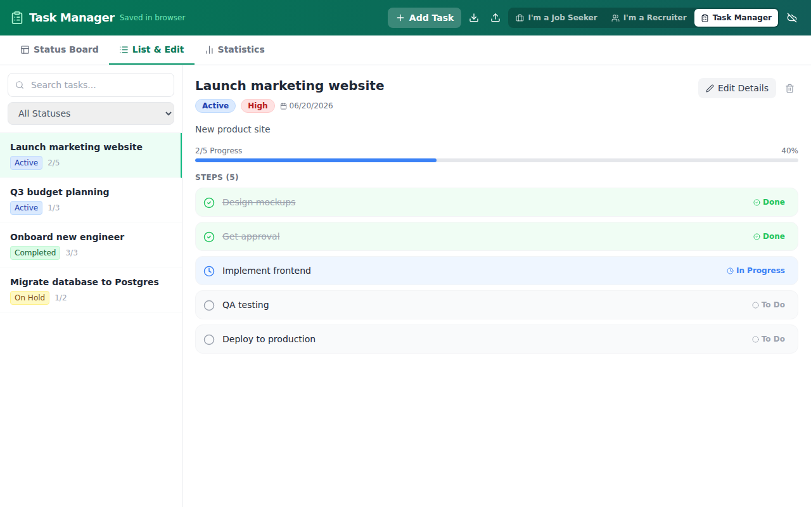
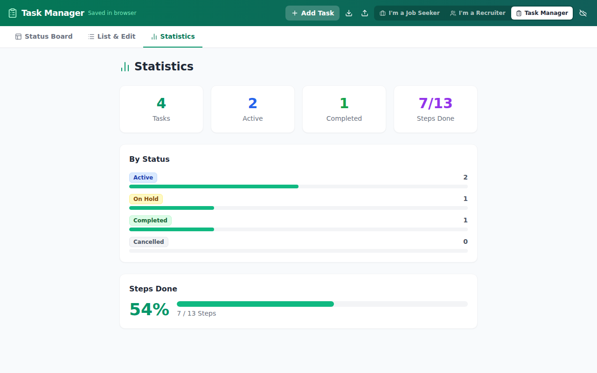
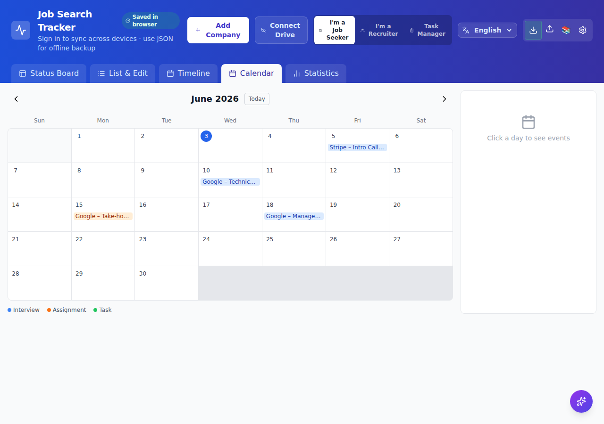
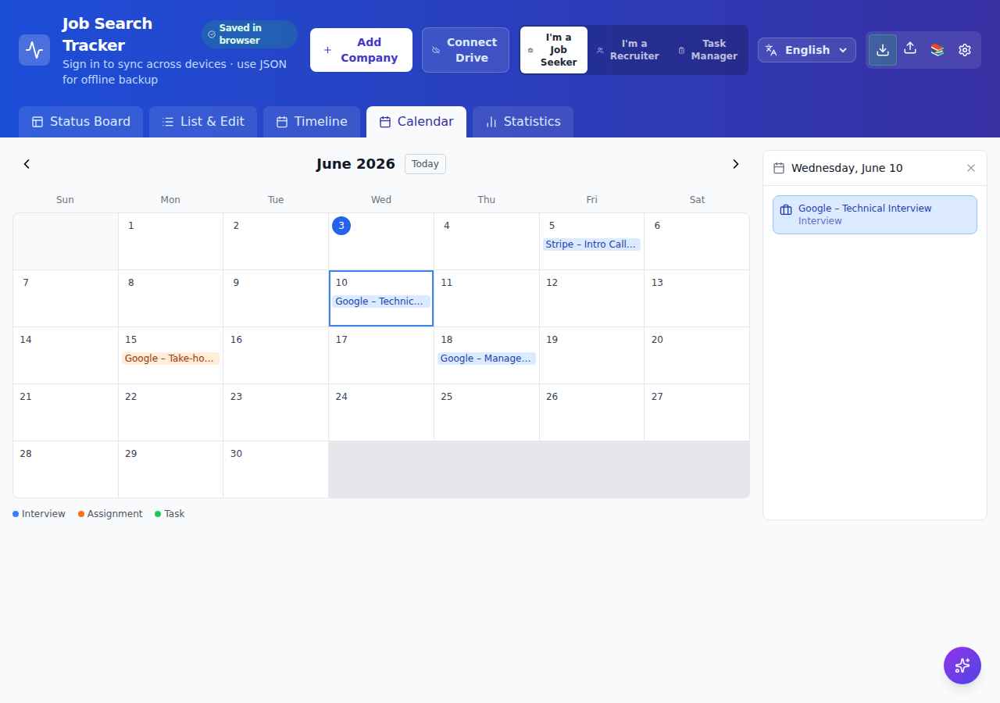

<p align="center">
  
</p>

# JobFlowTracker

Personal **job search**, **recruiter pipeline**, and **task management** tracker with AI assistance, kanban board, multi-language (EN/עב/FR), Firebase sync, and offline backup.

**Live app:** https://job-flow-tracker-ten.vercel.app

**Contributing:** [CONTRIBUTING.md](CONTRIBUTING.md) · **Issues:** [github.com/joka-7/JobFlowTracker/issues](https://github.com/joka-7/JobFlowTracker/issues) · **License:** [MIT](LICENSE)

---

## Three modes — switch anytime

| Mode | For | Tracks |
|------|-----|--------|
| **Job seeker** | People looking for work | Companies, applications, interviews |
| **Recruiter** | Hiring managers / recruiters | Candidates through hiring stages |
| **Task manager** | Anyone managing multi-step work | Tasks with ordered steps and per-step status |

Choose your starting mode on first visit. Switch freely at any time using the **mode switcher** in the app header — each mode keeps its own data independently.

See [docs/RECRUITER_MODE.md](docs/RECRUITER_MODE.md) for full recruiter details.

---

## Screenshots

### Mode selection


### Mode switcher (in header)



### Job Seeker mode

| Kanban board | List & company detail |
|---|---|
|  |  |

| AI Assistant | Statistics |
|---|---|
|  |  |

### Recruiter mode

| Kanban board | Candidate detail |
|---|---|
|  |  |

### Task Manager mode

| Kanban board | List & step detail | Statistics |
|---|---|---|
|  |  |  |

### Calendar view (all modes)

| Monthly grid | Day detail panel |
|---|---|
|  |  |

---

## Features

### Views & Navigation
- **Kanban board** — drag-and-drop cards across status columns
- **List & edit view** — detailed profiles with history and notes
- **Calendar** — monthly grid showing interviews, deadlines, and task due dates; click any day to see its events
- **Timeline** — chronological activity log of all interviews and submissions (job seeker & recruiter)
- **Stats** — counts, response rate, upcoming events, hiring funnel

### Task Manager
- Tasks contain **ordered steps**, each with its own status: To Do → In Progress → Done → Blocked
- Click any step status icon to cycle it without entering full edit mode
- Progress bar on every card: `done / total steps` and percentage
- "Next step" preview on board cards
- Board, List+Detail, and Stats views

### AI Assistant (5 providers, job seeker only)
Supports Google Gemini, Groq (free tier), Ollama (free/local), Anthropic Claude, and OpenAI.

- **Interview prep** — 3 focused preparation tips generated before each interview
- **Rejection analysis** — constructive improvement suggestions after a rejection
- **Pattern analysis** — identifies trends and themes across all your applications
- **Interview debrief** — structured analysis of post-interview notes
- **Smart scheduling** — day-by-day prep plan counting down to your interview date
- **Resume tailoring** — suggests which experiences and skills to highlight for each company
- **Multi-turn AI chat** — open-ended conversation with full company context loaded

### Data & Sync
- **Google Sign-In** — private, isolated data per user; no accounts to create
- **Firestore sync** — subcollection-based storage with granular writes
- **Offline backup** — export and import your full dataset as JSON at any time
- Each mode's data is stored independently: switching modes never loses data from other modes

### Interview Template Library
80+ curated questions across 6 categories: HR, Technical, Behavioral, Manager, Culture, and Questions to Ask.

### Onboarding & UX
- **Mode selection** — first-time users choose a starting mode; switch anytime from the header
- **Onboarding wizard** — 5-step guided tour on first visit (job seeker only)
- **3 languages** — English, Hebrew (RTL), French; persists across sessions
- **Keyboard shortcuts** — `N` to add a company/candidate/task, `Esc` to close

---

## How to Use

### 1. First Launch

**New users:** A full-screen mode picker asks which mode to start with. You can switch to any other mode at any time using the switcher in the app header.

**Returning users with existing data:** If you already have a JSON backup in the browser, the app auto-selects **Job Seeker** and skips the picker.

**Job seeker only:** A 5-step onboarding wizard may appear after mode selection. Click through or dismiss with **X**.

Sign in with Google using **Connect Drive** in the header. Your data is private and tied to your Google account.

### 2. Job seeker — Adding Your First Company

Click **+ Add Company** (or press `N`) to open the company form. Fill in:

- **Company name** (required)
- **Role** — the position you applied for
- **Status** — start with *Applied*
- **Priority** — High / Medium / Low
- **Location, Website, LinkedIn** — optional
- **General notes** — recruiter name, referral source, compensation details

Click **Save**. The company appears on the Kanban board and in the list.

### 2b. Recruiter — Adding Your First Candidate

Click **Add Candidate** (or press `N`). Fill in candidate name, position, hiring stage, and optional recruiter-specific fields (LinkedIn, current role, expected salary, source).

Data syncs to `users/{uid}/candidates/` when signed in. AI Assistant is not shown in recruiter mode.

### 2c. Task Manager — Adding Your First Task

Click **Add Task** (or press `N`). Fill in:

- **Task name** (required)
- **Description** — goal or context
- **Status** — Active / On Hold / Completed / Cancelled
- **Priority** and optional **Due Date**
- **Steps** — add as many steps as needed; each step gets its own status

After saving, click any step's status icon in the detail panel to cycle it:
`To Do → In Progress → Done → Blocked → To Do`

### 3. Tracking the Process

**Update status** — on the Kanban board, drag the card to the new column. In the list view, open the item and change the Status dropdown.

**Add an interview** — open the company, scroll to the Interviews section, click **+ Add Interview**.

**Log a rejection** — set status to *Rejected*. A section appears to record rejection details for AI analysis.

### 4. Switching Modes

The **mode switcher** appears in every app header as three small icon buttons (Briefcase / Users / ClipboardList). Click any icon to switch instantly. Each mode's data is stored separately and is never affected by switching.

### 5. Setting Up AI

Click the **gear icon (⚙️)** in the header to open AI Settings. Choose a provider:

| Provider | Cost | Notes |
|---|---|---|
| Groq | Free tier | Fast; get key at console.groq.com/keys |
| Ollama | Free (local) | Runs on your machine; needs CORS enabled |
| Google Gemini | Free tier / paid | Get key at aistudio.google.com/app/apikey |
| Anthropic Claude | Paid | Get key at console.anthropic.com/settings/keys |
| OpenAI | Paid | Get key at platform.openai.com/api-keys |

**Recommended for getting started:** Groq — create a free account, generate an API key, paste it in, and click **Save**.

### 6. Using the AI Assistant Panel

Once a provider is configured, open any company and click the **AI Assistant** button. The panel includes: Interview Prep, Smart Schedule, Rejection Analysis, Interview Debrief, Pattern Analysis, Resume Tailoring, and AI Chat.

### 7. Backup and Restore

**Export:** Click the download icon in the header. Your dataset downloads as `.json`.

**Import:** Click the upload icon and select a previously exported file.

### 8. Keyboard Shortcuts

| Shortcut | Action |
|---|---|
| `N` | Open "Add" form |
| `Esc` | Close modal / cancel form |

---

## Tech Stack

| Layer | Technology |
|---|---|
| Frontend | React 19, Vite |
| Styling | Tailwind CSS |
| Auth + DB | Firebase (Authentication + Firestore) |
| i18n | react-i18next (EN / עב / FR) |
| AI providers | Anthropic SDK, Groq, Gemini, OpenAI, Ollama |
| Icons | lucide-react |
| Hosting | Vercel |

---

## Project Structure

```
src/
├── App.jsx                  # Mode gate → ModeSelection, JobTrackerApp, or TasksApp
├── JobTrackerApp.jsx        # Job seeker + recruiter UI (~1500 lines)
├── TasksApp.jsx             # Task manager UI with step management
├── statuses.js              # Status configs for all 3 modes, storage keys
├── firebase.js              # Auth + mode-aware Firestore helpers
├── i18n.js                  # react-i18next setup
├── components/
│   ├── ModeSelection.jsx    # First-launch 3-mode picker
│   ├── ModeSwitcher.jsx     # Header mode switcher (3 icon buttons)
│   ├── AIAssistant.jsx      # Floating AI panel (job seeker only)
│   ├── Onboarding.jsx       # First-visit wizard (job seeker only)
│   └── ...
├── locales/                 # en.json, he.json, fr.json
├── __tests__/               # Vitest unit + integration tests
e2e/                         # Playwright end-to-end tests
docs/
├── HLD.md
├── LLD.md
├── RECRUITER_MODE.md
└── screenshots/
firestore.rules
playwright.config.js
```

---

## Run Locally

```bash
git clone https://github.com/joka-7/JobFlowTracker.git
cd JobFlowTracker
npm install
npm run dev
```

Open http://localhost:5173

---

## AI Setup

Click the **⚙️ gear icon** in the app header → choose your provider → paste your API key → **Save**.

| Provider | Free? | Where to get a key |
|---|---|---|
| Groq | Yes (free tier) | https://console.groq.com/keys |
| Ollama | Yes (runs locally) | https://ollama.ai — no key needed |
| Google Gemini | Free tier available | https://aistudio.google.com/app/apikey |
| Anthropic Claude | Paid | https://console.anthropic.com/settings/keys |
| OpenAI | Paid | https://platform.openai.com/api-keys |

**Ollama note:** Ollama must be started with CORS enabled:
```bash
OLLAMA_ORIGINS=* ollama serve
```

---

## Firebase & your data

**Using the [live app](https://job-flow-tracker-ten.vercel.app)?** You do not need a Firebase account or any backend setup.

1. Open the app and sign in with Google (**Connect Drive** in the header).
2. Your data is stored under your personal user ID (`users/{your-uid}/...`).
3. Firestore security rules ensure you can only read and write **your own** data.

---

## Backend setup (maintainers & self-hosters only)

Skip this section if you are only using the hosted app.

1. Create a project at https://console.firebase.google.com
2. Enable **Authentication** → Google Sign-In provider
3. Enable **Firestore Database** (start in production mode)
4. Add a Web app to the project → copy the config object
5. Replace the config in `src/firebase.js` with your project's values
6. Add your deployment domain to **Authentication → Settings → Authorized domains**

**Firestore security rules** — paste from [`firestore.rules`](firestore.rules):

```javascript
rules_version = '2';
service cloud.firestore {
  match /databases/{database}/documents {
    match /users/{userId} {
      allow read, write: if request.auth != null && request.auth.uid == userId;
      match /{document=**} {
        allow read, write: if request.auth != null && request.auth.uid == userId;
      }
    }
    match /shares/{userId} {
      allow read: if true;
      allow write: if request.auth != null && request.auth.uid == userId;
    }
  }
}
```

Deploy:
```bash
firebase deploy --only firestore:rules
```

---

## Deploy to Vercel

1. Push to GitHub
2. Import the repo at https://vercel.com
3. Framework preset: **Vite**
4. Deploy — no build configuration needed

---

## Run Tests

```bash
npm test          # Vitest — unit + integration
npm run test:e2e  # Playwright — browser e2e (port 5199)
npm run test:all  # Both suites
```

---

## Secret scanning (Gitleaks)

CI runs [Gitleaks](https://github.com/gitleaks/gitleaks) on every push and PR.

```bash
# Install (Linux x64)
mkdir -p ~/.local/bin
GITLEAKS_VERSION=v8.30.1
curl -sL "https://github.com/gitleaks/gitleaks/releases/download/${GITLEAKS_VERSION}/gitleaks_${GITLEAKS_VERSION#v}_linux_x64.tar.gz" \
  | tar -xz -C ~/.local/bin gitleaks
chmod +x ~/.local/bin/gitleaks

# Run scan
gitleaks detect --source .
```

The repo includes `.gitleaks.toml` which allowlists `src/firebase.js` (public project config, intentional).

---

## Data Schema

**Job seeker path:** `users/{uid}/companies/{companyId}`  
**Recruiter path:** `users/{uid}/candidates/{candidateId}`  
**Task manager path:** `users/{uid}/tasks/{taskId}`

**localStorage keys:** `jobTrackerAppV2Data_jobseeker`, `jobTrackerAppV2Data_recruiter`, `jobTrackerAppV2Data_tasks`

**Task document:**

```json
{
  "id": "1717600000000",
  "name": "Launch product website",
  "description": "Goal or context",
  "status": "active",
  "priority": "high",
  "dueDate": "2026-06-20",
  "notes": "Free-form notes",
  "steps": [
    { "id": "s1", "title": "Design mockups", "status": "done", "notes": "", "dueDate": "" },
    { "id": "s2", "title": "Implement frontend", "status": "in_progress", "notes": "", "dueDate": "" },
    { "id": "s3", "title": "Deploy to production", "status": "todo", "notes": "", "dueDate": "" }
  ]
}
```

**Task status values:** `active`, `on_hold`, `completed`, `cancelled`  
**Step status values:** `todo`, `in_progress`, `done`, `blocked`

**Company / candidate document** — see [docs/RECRUITER_MODE.md](docs/RECRUITER_MODE.md) for full field list.

---

## Contributing

Contributions are welcome. Please read [CONTRIBUTING.md](CONTRIBUTING.md) for setup, tests, and pull request guidelines.

- **Bug reports & features:** [Open an issue](https://github.com/joka-7/JobFlowTracker/issues/new/choose)
- **Pull requests:** Fork → branch → tests → PR to `main`
- **Security:** [SECURITY.md](SECURITY.md)
