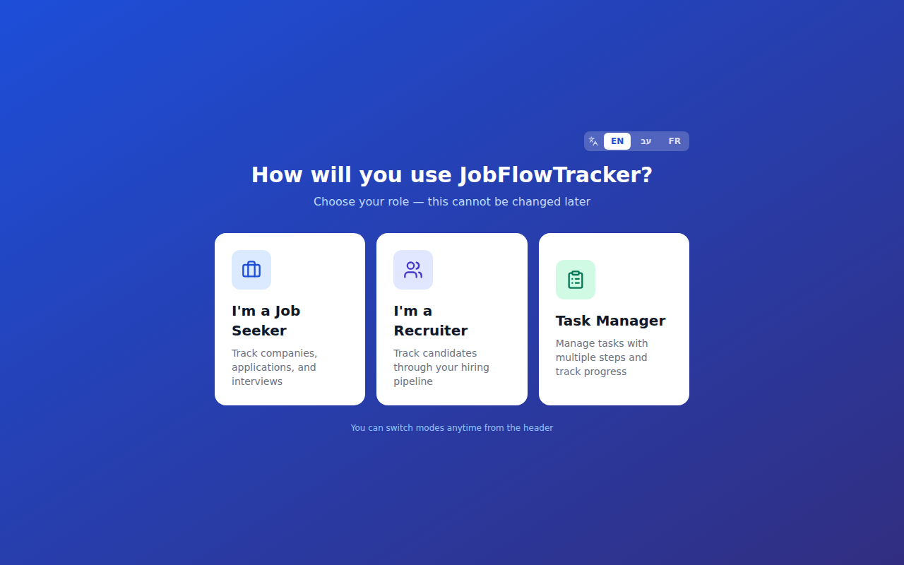
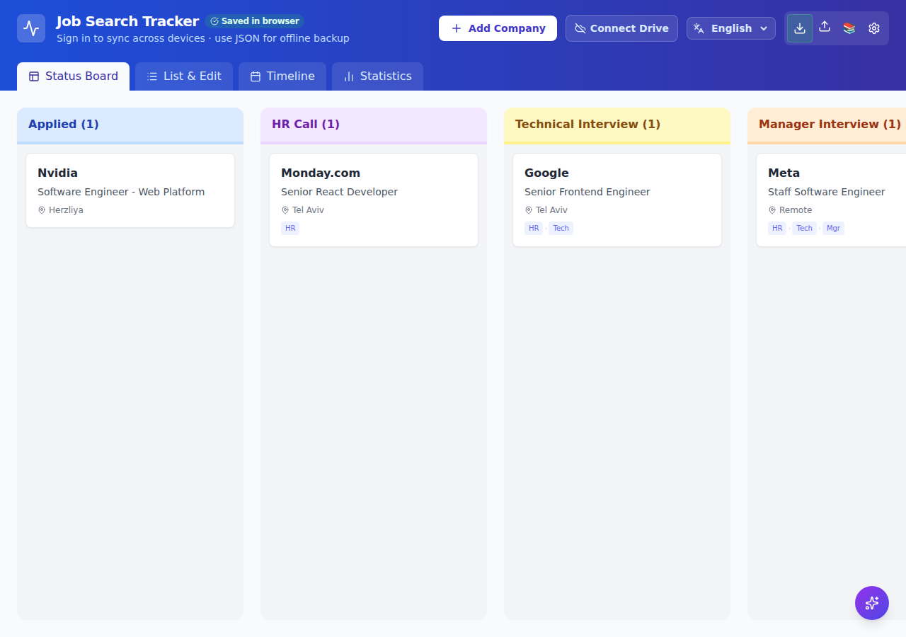
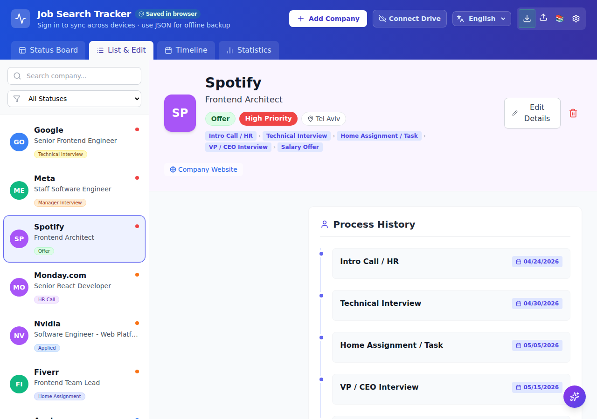
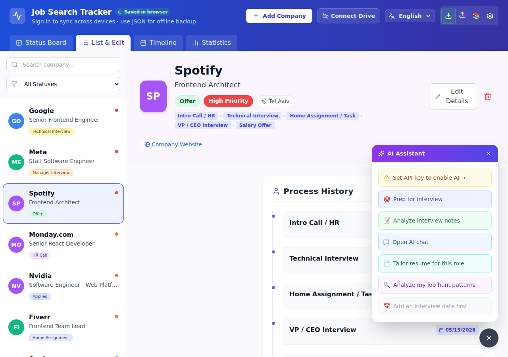
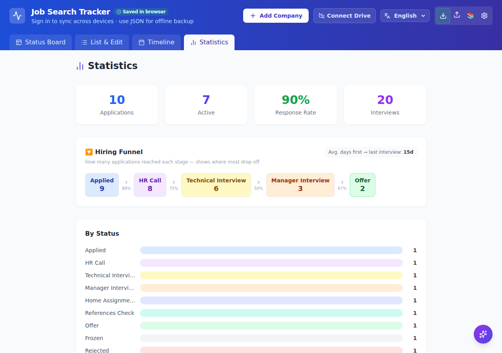
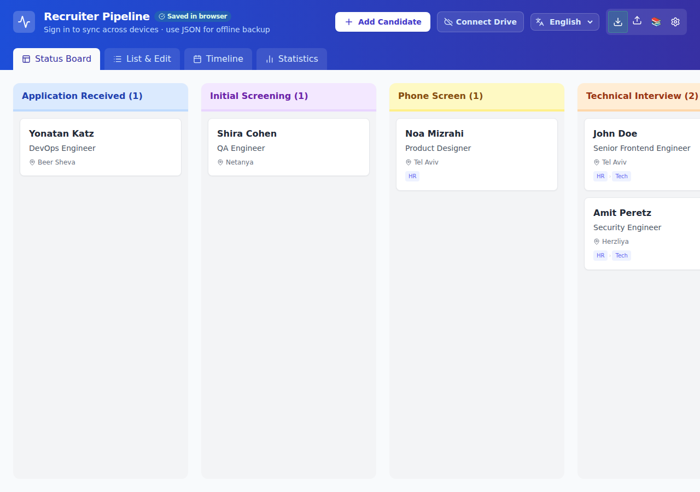
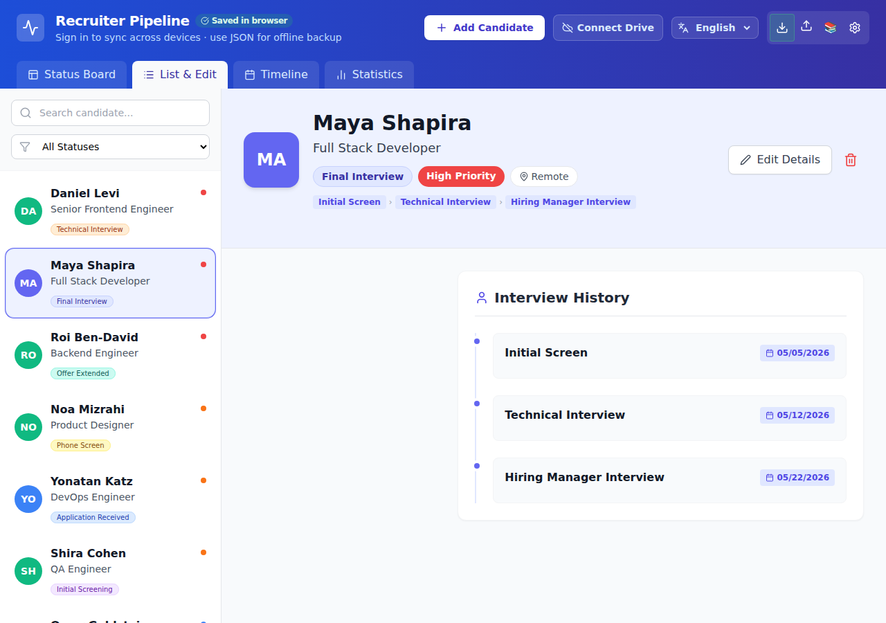
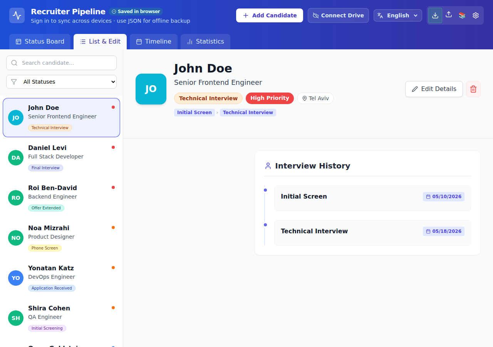
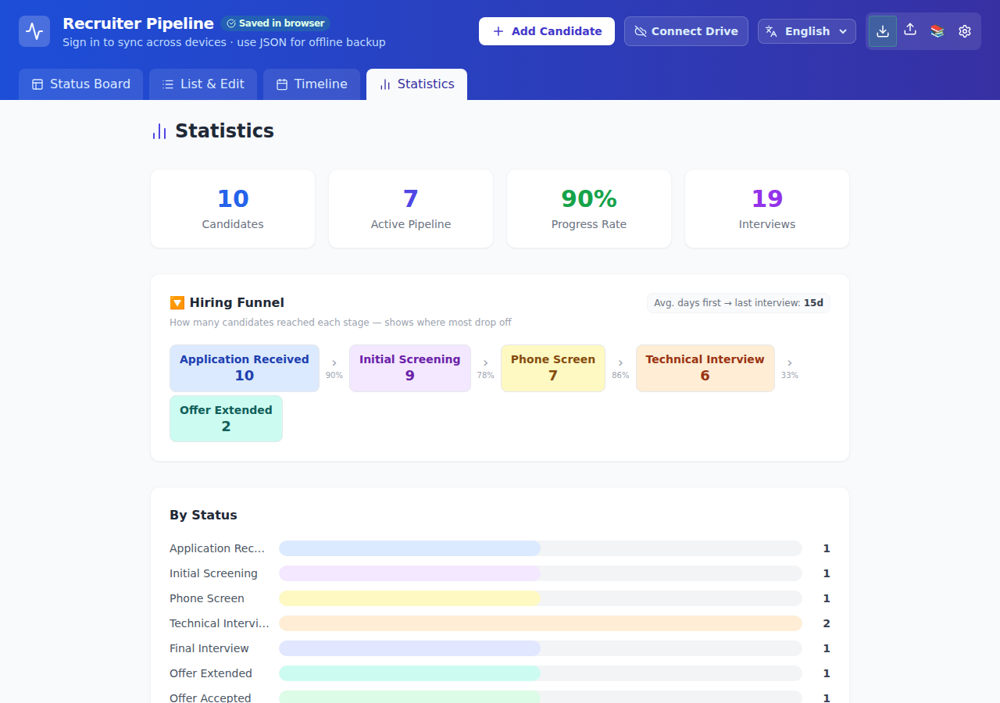

# JobFlowTracker

Personal job search **and recruiter pipeline** tracker with AI assistance (job seeker mode), kanban board, multi-language (EN/עב/FR), Firebase sync, and offline backup.

**Live app:** https://job-flow-tracker-ten.vercel.app

**Contributing:** [CONTRIBUTING.md](CONTRIBUTING.md) · **Issues:** [github.com/joka-7/JobFlowTracker/issues](https://github.com/joka-7/JobFlowTracker/issues) · **License:** [MIT](LICENSE)

---

## Two modes (chosen once at first launch)

| Mode | For | Tracks |
|------|-----|--------|
| **Job seeker** | People looking for work | Companies, applications, interviews |
| **Recruiter** | Hiring managers / recruiters | Candidates through hiring stages |

Mode is stored in `localStorage.appMode` and synced to your Firebase user profile. **There is no toggle** — pick once on first visit. See [docs/RECRUITER_MODE.md](docs/RECRUITER_MODE.md) for full recruiter details.

---

## Screenshots

### Mode selection



### Job Seeker mode

| Kanban board | List & company detail |
|---|---|
|  |  |

| AI Assistant | Statistics |
|---|---|
|  |  |

### Recruiter mode

| Kanban board | Candidate detail |
|---|---|
|  |  |

| AI Assistant | Statistics |
|---|---|
|  |  |

---

## Features

### Views & Navigation
- **Kanban board** — drag-and-drop cards across status columns (Applied, Screening, Tech Interview, HR Interview, Offer, Rejected, Ghosted, Withdrawn)
- **List & edit view** — detailed company profiles with interview history, rejection notes, and contacts
- **Timeline** — chronological activity log of all interviews and submissions
- **Stats** — application counts, response rate, upcoming interviews, and a Hiring Funnel showing conversion rates by stage

### AI Assistant (5 providers)
Supports Google Gemini, Groq (free tier), Ollama (free/local), Anthropic Claude, and OpenAI.

- **Interview prep** — 3 focused preparation tips generated before each interview
- **Rejection analysis** — constructive improvement suggestions after a rejection
- **Pattern analysis** — identifies trends and themes across all your applications
- **Interview debrief** — structured analysis of post-interview notes
- **Smart scheduling** — day-by-day prep plan counting down to your interview date
- **Resume tailoring** — suggests which experiences and skills to highlight for each company
- **Multi-turn AI chat** — open-ended conversation with full company context loaded

### Data & Sync
- **Google Sign-In** — private, isolated data per user; no accounts to create
- **Firestore sync** — subcollection-based storage with granular writes; auto-migrates legacy single-document data
- **Offline backup** — export and import your full dataset as JSON at any time

### Interview Template Library
80+ curated questions across 6 categories: HR, Technical, Behavioral, Manager, Culture, and Questions to Ask. Browse and copy questions directly into your interview prep.

### Onboarding & UX
- **Mode selection** — first-time users choose Job Seeker or Recruiter (fixed permanently)
- **Onboarding wizard** — 5-step guided tour on first visit (job seeker only)
- **3 languages** — English, Hebrew (RTL), French; persists across sessions
- **Keyboard shortcuts** — `N` to add a company/candidate, `Esc` to close

---

## How to Use

### 1. First Launch

**New users:** A full-screen mode picker asks whether you are a **Job Seeker** or **Recruiter**. This choice is saved permanently for this browser.

**Returning users with existing data:** If you already have a JSON backup in the browser, the app auto-selects **Job Seeker** and skips the picker.

**Job seeker only:** A 5-step onboarding wizard may appear after mode selection. Click through or dismiss with **X**. Recruiter mode skips the wizard.

Sign in with Google using **Connect Drive** in the header. Your data is private and tied to your Google account.

### 2. Job seeker — Adding Your First Company

Click the **+ Add Company** button (or press `N`) to open the company form. Fill in:

- **Company name** (required)
- **Role** — the position you applied for
- **Status** — start with *Applied*
- **Priority** — High / Medium / Low
- **Location, Website, LinkedIn** — optional but useful for quick reference
- **Description / Products** — notes about what the company does
- **General notes** — anything else: recruiter name, referral source, compensation details

Click **Save**. The company appears on the Kanban board and in the list.

### 2b. Recruiter — Adding Your First Candidate

Click **Add Candidate** (or press `N`). Fill in:

- **Candidate name** (required)
- **Position applied for**
- **Hiring stage** — start with *Application Received*
- **LinkedIn, current role, expected salary, source** — optional recruiter fields
- **Interviews** and **hiring notes** — same pipeline UI as job seeker

Data syncs to `users/{uid}/candidates/` when signed in. AI Assistant is not shown in recruiter mode.

### 3. Tracking the Process

**Update status** — on the Kanban board, drag the card to the new column. In the list view, open the company and change the Status dropdown, then save.

**Add an interview** — open the company, scroll to the Interviews section, click **+ Add Interview**. Fill in the type (e.g., Technical, HR), date, interviewer name, and a brief summary of how it went.

**Log a rejection** — set status to *Rejected*. A modal prompts you to record the rejection date, method (email, phone, portal), and any notes. This data feeds the AI rejection analysis.

**General notes** — use the General Notes field for anything free-form: salary discussed, red flags, next steps.

### 4. Using the Kanban Board

The board shows one column per status. Each card displays the company name, role, priority badge, and number of interviews logged.

**Drag and drop** — grab a card and drop it into a different column to update the status instantly. The change syncs to Firestore automatically if you are signed in.

**Filter** — use the search bar at the top to filter by company name or role. Use the status dropdown to restrict the board to one stage.

### 5. Setting Up AI

Click the **gear icon (⚙️)** in the header to open AI Settings. Choose a provider:

| Provider | Cost | Key required | Notes |
|---|---|---|---|
| Groq | Free tier | Yes | Fast; get key at console.groq.com/keys |
| Ollama | Free (local) | No | Runs on your machine; needs CORS enabled |
| Google Gemini | Free tier / paid | Yes | Get key at aistudio.google.com/app/apikey |
| Anthropic Claude | Paid | Yes | Get key at console.anthropic.com/settings/keys |
| OpenAI | Paid | Yes | Get key at platform.openai.com/api-keys |

**Recommended for getting started:** Groq — create a free account, generate an API key, paste it in, and click **Save**.

**Ollama (local):** Install from https://ollama.ai, pull a model (`ollama pull llama3.2`), and start the server with CORS enabled:
```bash
OLLAMA_ORIGINS=* ollama serve
```
No key is needed; just set the Ollama URL (default: `http://localhost:11434`).

### 6. Using the AI Assistant Panel

Once a provider is configured, open any company and click the **AI Assistant** button (sparkle icon). The panel slides in from the right with the following tabs:

- **Interview Prep** — generates 3 targeted tips based on the company description, role, and upcoming interview type. Click the button on any company with a scheduled interview.
- **Smart Schedule** — enter your interview date and get a day-by-day preparation plan counting down to it.
- **Rejection Analysis** — available after a rejection is logged. Returns constructive, actionable feedback based on your notes and interview history.
- **Interview Debrief** — after an interview, paste or type your notes and receive a structured analysis: what went well, what to improve, and follow-up questions.
- **Pattern Analysis** — analyzes all your applications at once to surface trends: response rates by industry, interview-to-offer conversion, common rejection themes.
- **Resume Tailoring** — given the company's products and description, suggests which resume experiences and skills to emphasize for that specific role.
- **AI Chat** — open-ended multi-turn chat with the company's full profile loaded as context. Ask anything: "What salary should I negotiate?", "Write a thank-you email", "How do I explain my career gap?"

All AI responses stream in real time. You can stop generation mid-stream with the **Stop** button.

### 7. Interview Template Library

Click **Templates** in the header (or the template icon on any company). The library contains 80+ questions across 6 categories:

- **HR** — compensation, timeline, process
- **Technical** — stack, code review, architecture
- **Behavioral** — STAR-format situational questions
- **Manager** — team structure, management style, growth
- **Culture** — values, work-life balance, remote policy
- **Questions to Ask** — questions you should ask the interviewer

Click any question to copy it to your clipboard. Use these to build a custom question list before each interview.

### 8. Backup and Restore

**Export:** Click **Export JSON** in the header menu. Your entire dataset downloads as a `.json` file. Store this as a backup or use it to migrate to another account.

**Import:** Click **Import JSON** and select a previously exported file. The import merges the data — existing entries by ID are overwritten, new ones are added. Always export first before importing to avoid data loss.

### 9. Keyboard Shortcuts

| Shortcut | Action |
|---|---|
| `N` | Open "Add Company" form |
| `Esc` | Close modal / cancel form |
| `Ctrl+S` | Save form (when a form is open) |

---

## Tech Stack

| Layer | Technology |
|---|---|
| Frontend | React 18, Vite |
| Styling | Tailwind CSS |
| Auth + DB | Firebase (Authentication + Firestore) |
| i18n | react-i18next |
| AI providers | Anthropic SDK, Groq, Gemini, OpenAI, Ollama |
| Icons | lucide-react |
| Hosting | Vercel |

---

## Project Structure

```
src/
├── JobTrackerApp.jsx        # Main app — UI, state, mode-aware labels/forms
├── statuses.js              # Job seeker + recruiter status configs
├── firebase.js              # Auth + mode-aware Firestore helpers
├── i18n.js                  # react-i18next setup
├── App.jsx                  # Mode gate → ModeSelection or JobTrackerApp
├── components/
│   ├── ModeSelection.jsx    # First-launch job seeker vs recruiter picker
│   ├── AIAssistant.jsx      # Floating AI panel (job seeker only)
│   ├── Onboarding.jsx       # First-visit wizard (job seeker only)
│   └── ...
├── locales/                 # en.json, he.json, fr.json (+ recruiter.* namespace)
├── __tests__/               # Vitest unit + integration tests
e2e/                         # Playwright end-to-end tests
docs/
├── HLD.md
├── LLD.md
└── RECRUITER_MODE.md        # Recruiter mode reference
firestore.rules
playwright.config.js
```

---

## Run Locally

```bash
git clone https://github.com/joka-7/JobFlowTracker.git
cd JobFlowTracker
npm install
npm run dev
```

Open http://localhost:5173

---

## AI Setup

Click the **⚙️ gear icon** in the app header → choose your provider → paste your API key → **Save**.

| Provider | Free? | Where to get a key |
|---|---|---|
| Groq | Yes (free tier) | https://console.groq.com/keys |
| Ollama | Yes (runs locally) | https://ollama.ai — no key needed |
| Google Gemini | Free tier available | https://aistudio.google.com/app/apikey |
| Anthropic Claude | Paid | https://console.anthropic.com/settings/keys |
| OpenAI | Paid | https://platform.openai.com/api-keys |

**Ollama note:** Ollama must be started with CORS enabled so the browser can reach it:
```bash
OLLAMA_ORIGINS=* ollama serve
```

---

## Firebase & your data

**Using the [live app](https://job-flow-tracker-ten.vercel.app)?** You do not need a Firebase account or any backend setup.

1. Open the app and sign in with Google (**Connect Drive** in the header).
2. Your companies or candidates are stored in the app’s shared Firebase project, under your personal user ID (`users/{your-uid}/...`).
3. Firestore security rules ensure you can only read and write **your own** data — other users cannot see yours.

The only optional setup is **AI** (see [AI Setup](#ai-setup) above) if you want interview prep, rejection analysis, etc.

---

## Backend setup (maintainers & self-hosters only)

Skip this section if you are only using the hosted app. It applies when you **clone the repo and deploy your own instance** with a separate Firebase project.

The repo already includes a Firebase web config in `src/firebase.js` for the production deployment. To run your own copy:

1. Create a project at https://console.firebase.google.com
2. Enable **Authentication** → Google Sign-In provider
3. Enable **Firestore Database** (start in production mode)
4. Add a Web app to the project → copy the config object
5. Replace the config in `src/firebase.js` with your project’s values
6. Go to **Authentication → Settings → Authorized domains** and add your deployment domain (e.g., your Vercel URL)

**Firestore security rules** — paste from [`firestore.rules`](firestore.rules) into Firebase Console → Firestore → Rules → **Publish**:

```javascript
rules_version = '2';
service cloud.firestore {
  match /databases/{database}/documents {
    match /users/{userId} {
      allow read, write: if request.auth != null && request.auth.uid == userId;
      match /{document=**} {
        allow read, write: if request.auth != null && request.auth.uid == userId;
      }
    }
    match /shares/{userId} {
      allow read: if true;
      allow write: if request.auth != null && request.auth.uid == userId;
    }
  }
}
```

This allows each signed-in user to read/write their profile, `companies`, and `candidates` subcollections. Read-only share snapshots (`/shares/{uid}`) are world-readable when published; only the owner can write them.

Deploy rules via CLI:

```bash
firebase deploy --only firestore:rules
```

---

## Deploy to Vercel

1. Push to GitHub
2. Import the repo at https://vercel.com
3. Framework preset: **Vite**
4. Deploy — no build configuration needed beyond the preset

---

## Run Tests

```bash
npm test          # Vitest — unit + integration (155 tests)
npm run test:e2e  # Playwright — browser e2e (12 tests, port 5199)
npm run test:all  # Both suites
```

**Unit/integration** (`src/__tests__/`): AI providers, mode selection, statuses config, onboarding, components, business logic.

**E2E** (`e2e/`): Real browser flows — mode picker, add company/candidate, localStorage persistence, export, recruiter stats. Uses a dedicated dev server on port **5199** (avoids conflicting with other apps on 5173).

---

## Data Schema

Entities share the same document shape; meaning of `name` / `role` depends on mode.

**Job seeker path:** `users/{uid}/companies/{companyId}`  
**Recruiter path:** `users/{uid}/candidates/{candidateId}`

**localStorage:** `jobTrackerAppV2Data_jobseeker` or `jobTrackerAppV2Data_recruiter`

**Company / candidate document (shared shape):**

```json
{
  "id": "1234567890",
  "name": "Acme Corp",
  "role": "Software Engineer",
  "status": "tech_interview",
  "priority": "high",
  "location": "Tel Aviv",
  "website": "https://acme.com",
  "linkedinCompany": "https://linkedin.com/company/acme",
  "linkedinHR": "https://linkedin.com/in/recruiter",
  "description": "What the company does",
  "products": "Main products or services",
  "generalNotes": "Free-form personal notes",
  "interviews": [
    {
      "type": "Technical Interview",
      "date": "2026-05-01",
      "interviewer": "Jane Smith",
      "summary": "Went well, discussed system design"
    }
  ],
  "rejection": {
    "date": "2026-05-10",
    "method": "email",
    "notes": "Went with a more senior candidate"
  }
}
```

**Job seeker status values:** `applied`, `hr_call`, `tech_interview`, `manager_interview`, `home_assignment`, `references`, `offer`, `frozen`, `rejected`, `ghosted`, `withdrawn`

**Recruiter status values:** `applied`, `screening`, `phone_screen`, `technical`, `final_interview`, `offer_extended`, `offer_accepted`, `rejected`, `withdrawn`

See [docs/RECRUITER_MODE.md](docs/RECRUITER_MODE.md) for recruiter field details.

---

## Contributing

Contributions are welcome. Please read [CONTRIBUTING.md](CONTRIBUTING.md) for setup, tests, and pull request guidelines.

- **Bug reports & features:** [Open an issue](https://github.com/joka-7/JobFlowTracker/issues/new/choose)
- **Pull requests:** Fork → branch → tests → PR to `main` (CI runs automatically)
- **Security:** [SECURITY.md](SECURITY.md)
